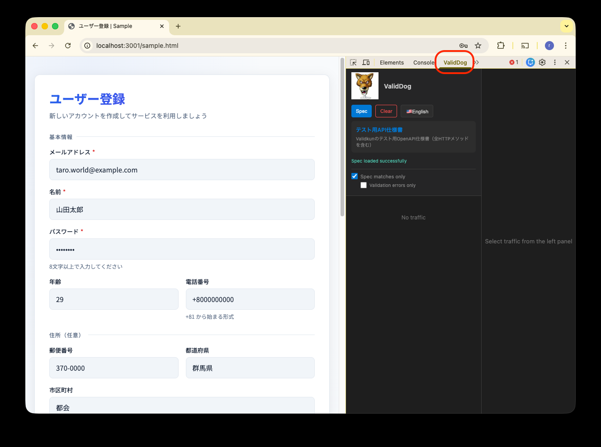
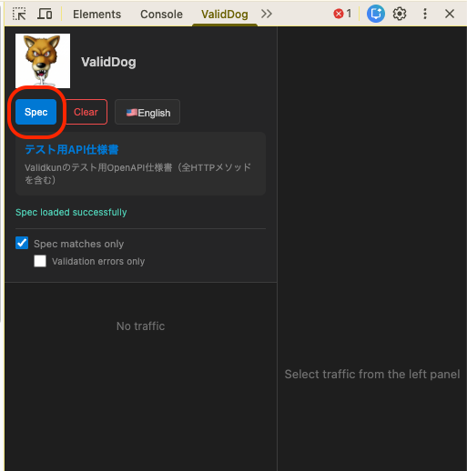
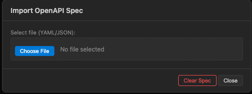
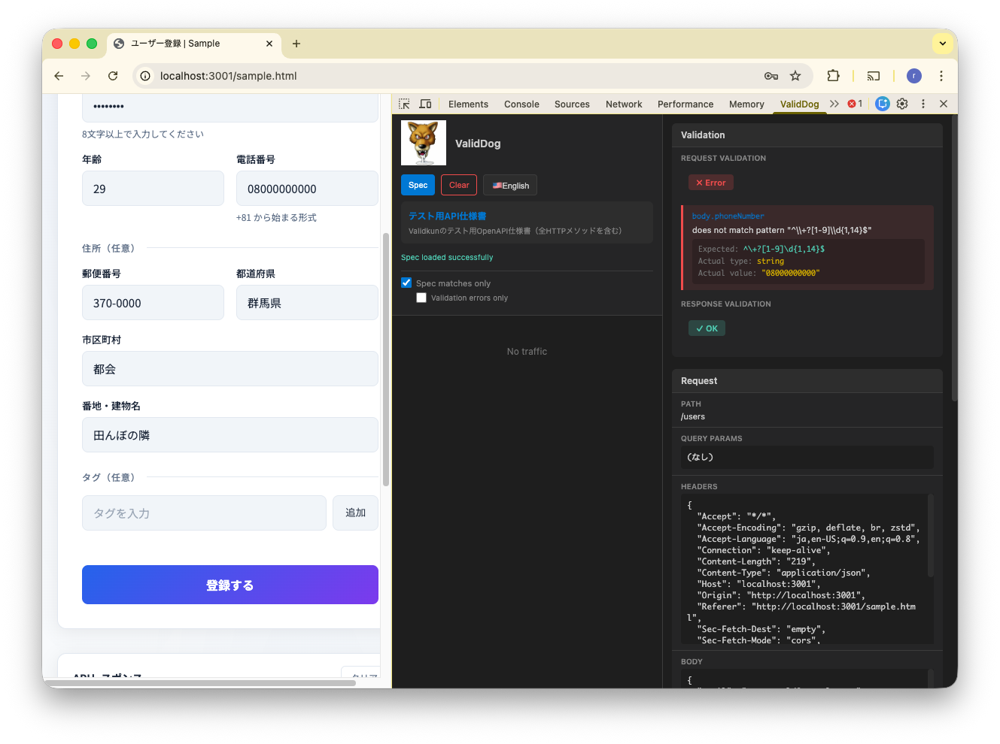

## Getting Started
Open Chrome and press F12 to open Dev Tools.

Once Dev Tools is open, select the "ValidDog" tab.

## Loading an OpenAPI Specification
To load an OpenAPI specification containing the API information you want to monitor, click the "Spec" button.

Click the "Select file" button. Both YAML and JSON formats are supported.

## How to Use
### "Spec matches only"
When this checkbox is enabled, only paths that exist in the specification will be displayed in the history.

### "Validation errors only"
When this checkbox is enabled, only requests/responses that exist in the specification but do not conform to it will be displayed.

## Specifications
Validation is available for path parameters, query parameters, request headers, request body, response headers, and response body.
Base URL cannot be configured. Paths are automatically detected by suffix matching against the OpenAPI specification.

